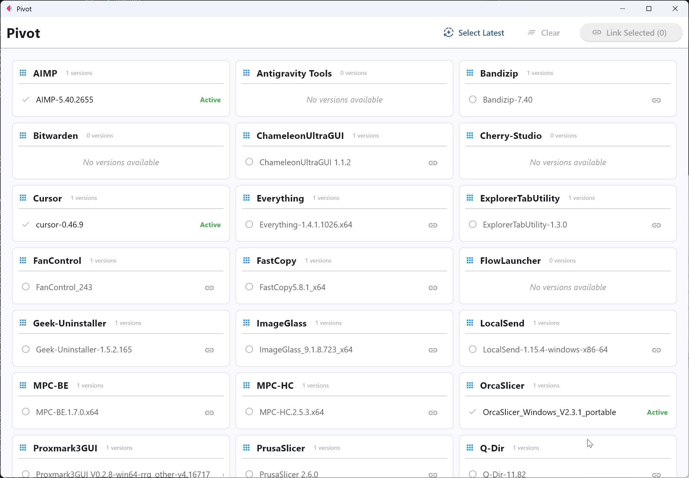

# Pivot



**Pivot** is a Windows desktop application built with [Flet](https://flet.dev) designed for efficient directory and version management. 

It serves as a "link manager" that separates physical file storage from access points, allowing you to switch between different versions of software or portable apps instantly without changing your environment variables or shortcuts.

> **Note**: This application was generated by an AI Agent.

## Features

*   **Version Management**: Organize and visualize multiple versions of portable apps in one place.
*   **Instant Switching**: Seamlessly toggle between versions using system symlinks.
*   **Auto-Discovery**: Automatically groups physical folders into applications and detects version numbers.
*   **Batch Updates**: Quickly identify and link the latest versions for multiple applications at once.

## Core Concept

Pivot follows a strict directory separation philosophy:

1.  **Versions Storage (`Versions/`)**: All physical application versions are stored here (e.g., `Versions/App-v1`, `Versions/App-v2`).
2.  **Persistent Access (`Persists/`)**: This directory contains Symbolic Links (or Junctions) pointing to the active version in the `Versions` folder.

### Directory Structure Example

```text
Root/
├── Versions/                  # Physical Storage
│   ├── Bandizip-7.30/
│   ├── Bandizip-7.40/
│   └── Nodejs-14.0.0/
│
└── Persists/                  # Access Points (Symlinks)
    ├── Bandizip -> ..\Versions\Bandizip-7.40  # Active version
    └── Nodejs   -> ..\Versions\Nodejs-14.0.0
```

By adding `Persists/` to your system PATH, you can update tools simply by switching links in Pivot, without ever modifying PATH again.

## Build from Source

If you wish to run the application from source code or compile it yourself, make sure you have [uv](https://github.com/astral-sh/uv) installed, then follow these steps.

### Run from Source

1.  Clone the repository.
2.  Install dependencies:
    ```bash
    uv sync
    ```
3.  Run the application:
    ```bash
    uv run flet run
    ```

### Build Standalone EXE

To create a portable `.exe` file for Windows:

```bash
build_exe.bat
```

The output executable will be located in the `dist/` folder.

## Development

*   **Linting**: `uv run ruff check .`
*   **Formatting**: `uv run ruff format .`
*   **Type Checking**: `uv run mypy src`
*   **Testing**: `uv run pytest`

## Credits

This project was designed and written by an AI Assistant.
