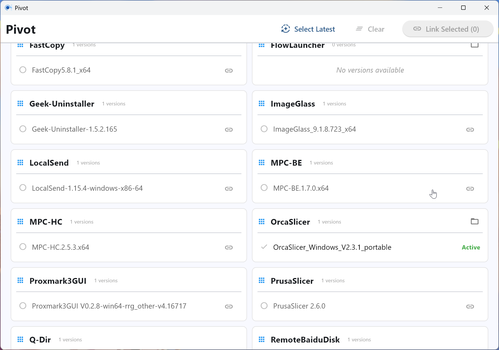

# Pivot

[English](README.md) | [中文](README_zh.md)



**Pivot** 是一款基于 [Flet](https://flet.dev) 构建的 Windows 桌面应用程序，专为高效的目录和版本管理而设计。

它充当一个“链接管理器”，将物理文件存储与访问入口分离开来，让您能够即时切换不同版本的软件或便携式应用，而无需更改环境变量或快捷方式。

> **注意**: 此应用程序由 AI Agent 生成。

## 功能特性

*   **版本管理**: 在一处组织和可视化便携式应用的多个版本。
*   **即时切换**: 使用系统符号链接无缝切换版本。
*   **自动发现**: 自动将物理文件夹分组为应用程序并检测版本号。
*   **批量更新**: 快速识别并一次性链接多个应用程序的最新版本。

## 核心概念

Pivot 遵循严格的目录分离理念：

1.  **版本存储 (`Versions/`)**: 所有物理应用程序版本都存储在此处（例如 `Versions/App-v1`, `Versions/App-v2`）。
2.  **持久访问 (`Persists/`)**: 此目录包含指向 `Versions` 文件夹中活动版本的符号链接（或联接）。

### 目录结构示例

```text
Root/
├── Versions/                  # 物理存储
│   ├── Bandizip-7.30/
│   ├── Bandizip-7.40/
│   └── Nodejs-14.0.0/
│
└── Persists/                  # 访问入口 (符号链接)
    ├── Bandizip -> ..\Versions\Bandizip-7.40  # 活动版本
    └── Nodejs   -> ..\Versions\Nodejs-14.0.0
```

通过将 `Persists/` 添加到您的系统 PATH 中，您只需在 Pivot 中切换链接即可更新工具，而无需再次修改 PATH。

## 从源码构建

如果您希望从源代码运行应用程序或自行编译，请确保已安装 [uv](https://github.com/astral-sh/uv)，然后按照以下步骤操作。

### 从源码运行

1.  克隆仓库。
2.  安装依赖项：
    ```bash
    uv sync
    ```
3.  运行应用程序：
    ```bash
    uv run flet run
    ```

### 构建独立 EXE

要在 Windows 上创建便携式 `.exe` 文件：

```bash
build_exe.bat
```

输出的可执行文件将位于 `dist/` 文件夹中。

## 开发

*   **代码检查 (Linting)**: `uv run ruff check .`
*   **格式化 (Formatting)**: `uv run ruff format .`
*   **类型检查 (Type Checking)**: `uv run mypy src`
*   **测试 (Testing)**: `uv run pytest`

## 致谢

本项目由 AI 助手设计并编写。
